# Clustering and recognition of faces in a photo album

## Use case description

The objective is to detect and cluster faces from a personal photo album,
and then recognize a person when she is part of the album or identify her as a stranger
(an outlier in statistical terms).

The critical point in the clustering phase is that we don't know in advance how many different
persons are in the album, some of whom may appear often (the familiars), whereas others may appear
once or twice (strangers who just happened to be there).

In the recognition step, the difficulty is to decide whether a person is an outlier or not.

## Methodology

- **Step 1**: detection of the faces in the images of the photo album.

    To do that, I rely on a **Multitask Cascaded Convolutional Network** introduced in [[1]](#ref1).
    I'm using a *PyTorch* implementation available [here](https://github.com/timesler/facenet-pytorch)
    [[2]](#facenet-repo).
    Each face is extracted as a 160x160 pixels RGB image.

- **Step 2**: embedding of the faces in a lower dimensional space.

    From the same repo [[2]](#facenet-repo), I'm using an Inception Resnet (V1) model,
    pretrained on VGGFace2 using the **FaceNet** method [[3]](#ref3).
    This method directly optimizes the embedding rather than using an intermediate bottleneck layer
    as the feature mapping. 
    After this step, each face is represented by a vector of size 512.
    
    As a last preprocessing step before the clustering, I further perform a PCA on the whole
    set of embedded faces, keeping only 32 components (this transform is however optional and
    can be deactivated).
    I tried several other dimensionality reduction techniques, in particular non-linear ones
    such as Isomap or Spectral embedding, but none gave better results than PCA.
    This totally makes sense since facenet embeddings are already designed to represent
    "optimally" faces on a sphere, hence only a linear transformation can preserve
    the learned manifold structure.

- **Step 3**: clustering of the faces.
    
    I'm implementing an agglomerative clustering algorithm based on
    a **graph degree linkage** method.
    The latter is described in [[4]](#ref4).

    The principle is the following: starting with an initial set of clusters, two clusters
    are recursively merged together if their affinity is the highest, the latter being defined by
    
    
    
        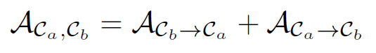
    

    
    where
    
    
        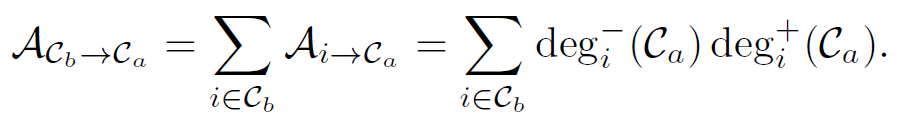
    

    The inner and outter degrees are computed with the weights of a directed K-nearest neighbors
    graph by the following formulas:
    
    
    
        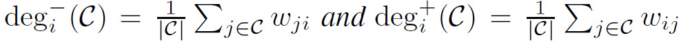
    

    When the desired number of clusters is reached, the agglomerative process stops.
    Alternatively, if the number of final clusters is not known, the process stops when
    the highest clusters affinity reaches a lower bound.

- **Step 4**: recognition of faces.

    To decide if a new face belongs to one of the persons in the album or to a newcomer,
    we compute its affinity with all the clusters.
    If all these affinities are lower than a certain threshold, then the person is declared
    to be a stranger, otherwise her identity is given by the cluster with the highet affinity.

## Parameter optimization

Three parameters need to be estimated:
- the number K of neighbors to use in the graph,
- the affinity level below which the agglomerative process stops,
- the affinity threshold to declare someone unknown.

To estimate these parameters, I used the [LFW face database](http://vis-www.cs.umass.edu/lfw/)
to create synthetic photo albums with known identities for performance evaluation.
I evaluated the best parameters on two types of album with roughly 500 to 550 different faces
in each.
In the first album type, I selected 7 persons with 50 to 200 different faces each (the familiars)
and 14 other persons with 1 to 3 different faces each (the strangers).
In the second album type, I selected 40 familiars with 10 to 20 different faces and 10 strangers
with 1 or 2 faces.
In both cases, for the recognition evaluation, I created a test set by selecting,
for each person in the album (familiar or stranger), few faces which are removed from the album,
and I sampled few faces of persons out of the album to serve as outliers.

To evaluate the clustering algorithm, I generated 30 random albums (of one of the two types
described above) and computed the *normalized mutual information* and the *clustering error*
(see [[5]](#ref5) for instance).
I then reported their mean value and a 5% confidence interval.
To optimize the number of neighbors, I fixed the number of clusters (21 in type-1 albums,
50 in type-2 albums).
To optimize the affinity level, I also reported the number of clusters found by the algorithm.
To evaluate the recognition algorithm, I gave a binary label to each face in the test set,
depending on its presence or not in the album, and computed the F1 score.

### Parameter estimation for type-1 albums (7 familiars, 14 stangers, ~500-550 faces)

When there are many different faces for each familiar, the optimal number of neighbors to use
in the directed graph is around 40.

    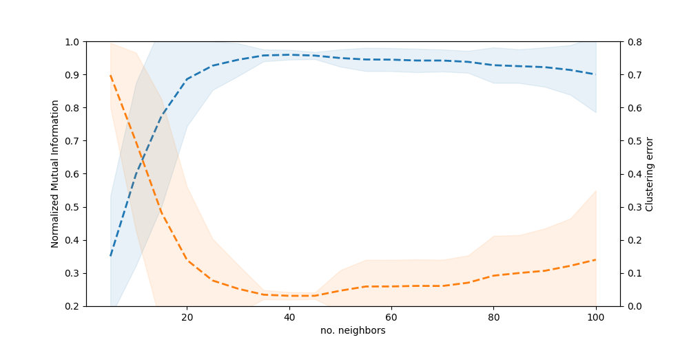

As for the minimum affinity level (eps), there is no clear optimal choice.
A value between 0.0075 and 0.015 is a good compromise between the accuracy and
the number of clusters found.

    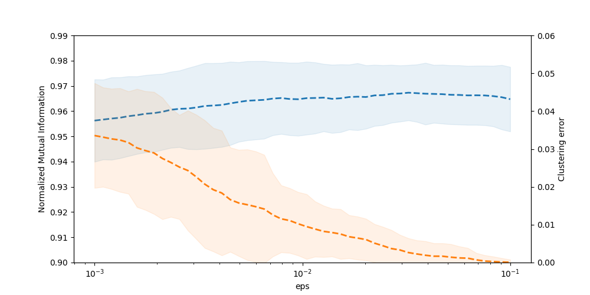

    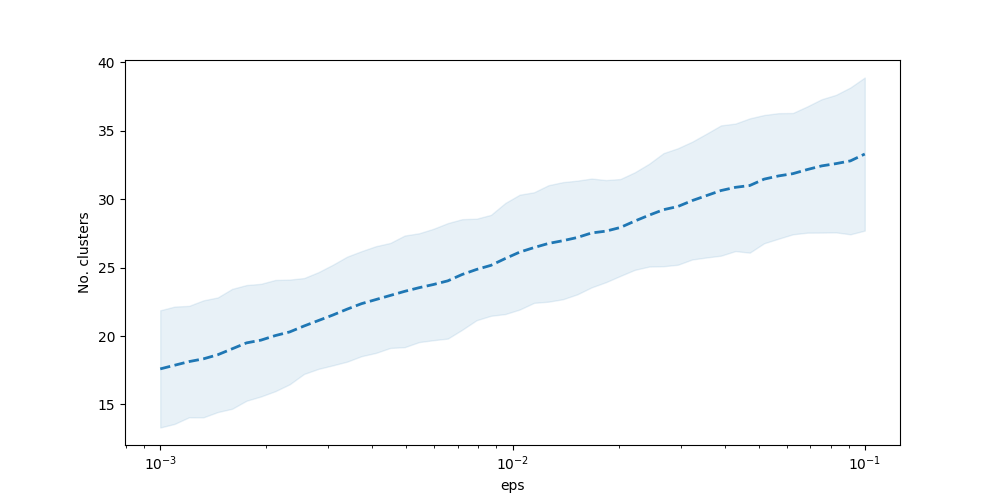

Regarding the affinity threshold for the recognition module, we express it as a ratio (alpha)
with respect to the minimum affinity level which is used in the clustering algorithm.
Without surprise a value close to 1 gives the best results.

    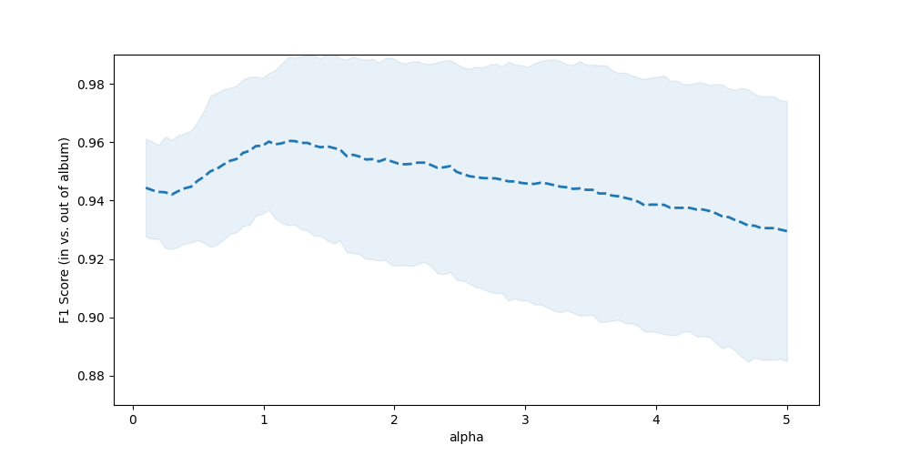

### Parameter estimation for type-2 albums (40 familiars, 10 stangers, ~500-550 faces)

When there are less faces for each familiar, the number of neighbors to use in the directed graph
needs to be lowered to approximately 10.

    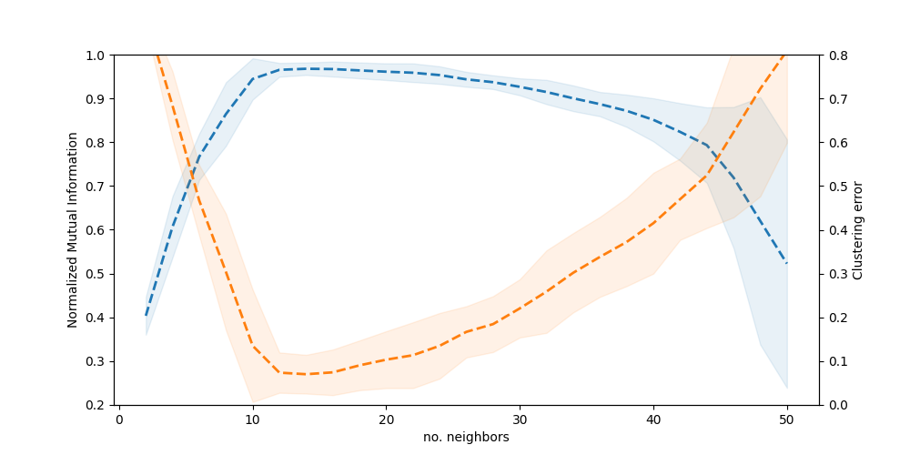

As for the minimum affinity level (eps), the optimal choice is also very different from
type-1 albums, with a good choice around 0.15.

    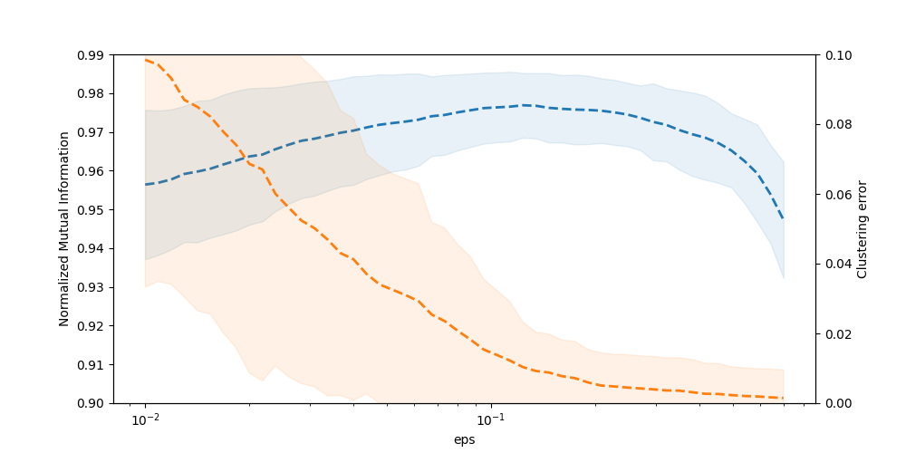

    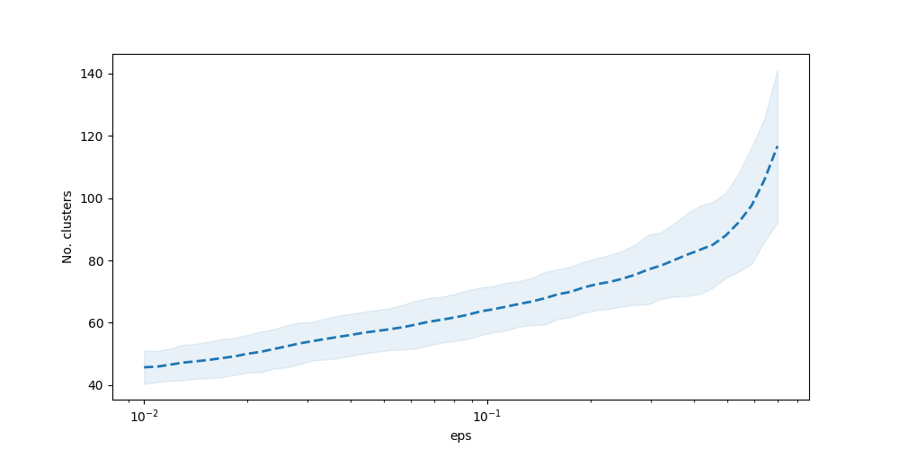

However, for the recognition affinity threshold (alpha), the result is consistant with
the previous case, with a good choice around 1.

    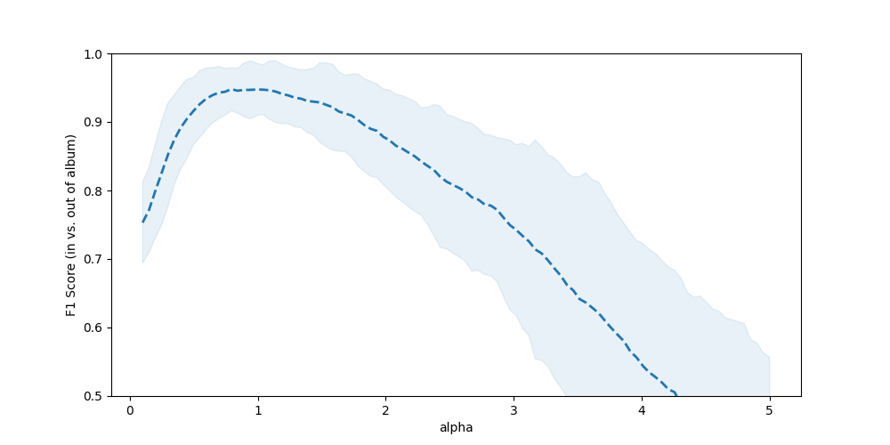

### Conclusion

The optimal number of neighbors to use in the graph and the minimum affinity level are
very sensible to the dataset.
Tuning these parameters in an unsupervised fashion remains a challenge.

## A personal example

I tested the above algorithms on a personal album made of 28 photos, of which 60 faces were extracted.
There are 11 different persons, with a variable number of faces (1 to 10).

The best result is obtained with a number of 5 neighbors in the graph and
an affinity level of 0.05.
The clustering algorithm produces 14 clusters, 4 of which have only one face in it
(identified as "Snowgies").
Among these 4 faces, 3 should belong to an other cluster, but apart from that, there is only 1 error,
which even a human would probably make (hint: "happy Kristoff" came to bother her sister
"focused Sitron" again).

It is quite amazing to see that even with very different illumination conditions or poses,
and with very few examples, the clustering is accurate.

    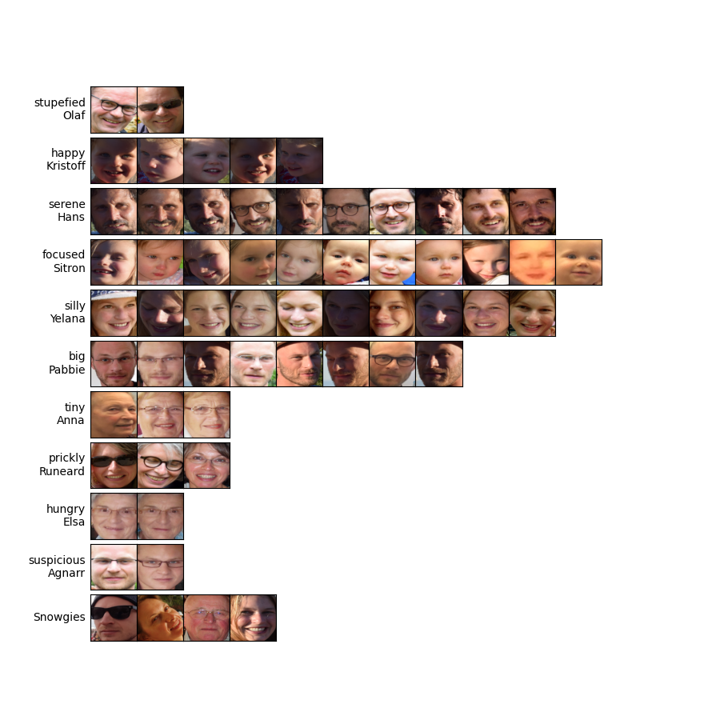

I also tested the recognition module on me, with a photo of "happy Kristoff" and
"focused Sitron" together, and a fake face from
[thispersondoesnotexist.com](https://thispersondoesnotexist.com/).

    

## Try it yourself?

To experiment on your own set of photos, you first need to set up a (virtual) python environment
with the required packages.
(Yes, you know how to do it! Pay attention to pytorch installation however.)
Then you need to clone the repo and create a folder
`photo_album_faces/data/album` containing your photos.

In the `src` folder there are 3 scripts:
- `face_extract.py` to... extract the faces from the photos and save them in
    `photo_album_faces/data/faces`,
- `face_cluster.py` to... perform the clustering and display the result,
- `face_recog.py` to... activate the webcam face recognition.

If you want to reproduce the results of the parameter optimization section, the scripts are in
`photo_album_faces/src/test`.
You'll need to download in `photo_album_faces/data/lfw` the [LFW face database](http://vis-www.cs.umass.edu/lfw/)
as well as the `lfw-names.txt` file, which you can find on the same page.

One last remark: when instanciating the neural network models (mtcnn and facenet),
their pretrained weights are automatically downloaded and stored in 
`photo_album_faces/data/checkpoints`.

## References

- <a name=ref1>[1]</a>
Kaipeng Zhang, Zhanpeng Zhang, Zhifeng Li, Yu Qiao.
_Joint face detection and alignment using multitask cascaded convolutional networks._
IEEE Signal Processing Letters, 23(10):1499–1503, 2016.
[pdf](https://arxiv.org/ftp/arxiv/papers/1604/1604.02878.pdf)

- <a name=facenet-repo>[2]</a> Tim Esler's [facenet-pytorch](https://github.com/timesler/facenet-pytorch) repo.

- <a name=ref3>[3]</a>
Florian Schroff, Dmitry Kalenichenko, James Philbin.
_FaceNet: A Unified Embedding for Face Recognition and Clustering._
Proceedings of the IEEE Conference on Computer Vision and Pattern Recognition (CVPR),
2015, pp. 815-823.
[pdf](https://www.cv-foundation.org/openaccess/content_cvpr_2015/papers/Schroff_FaceNet_A_Unified_2015_CVPR_paper.pdf)

- <a name=ref4>[4]</a>
Wei Zhang, Xiaogang Wang, Deli Zhao, Xiaoou Tang.
_Graph Degree Linkage: Agglomerative Clustering on a Directed Graph._
Proceedings of the 12th European Conference on Computer Vision (ECCV), 2012, pp. 428-441.
[pdf](https://arxiv.org/abs/1208.5092)

- <a name=ref5>[5]</a>
Mingrui Wu, Bernhard Schölkopf.
_A Local Learning Approach for Clustering._
Advances in Neural Information Processing Systems (NIPS), 2006, pp. 1529-1536.
[pdf](https://papers.nips.cc/paper/2006/file/366f0bc7bd1d4bf414073cabbadfdfcd-Paper.pdf)
